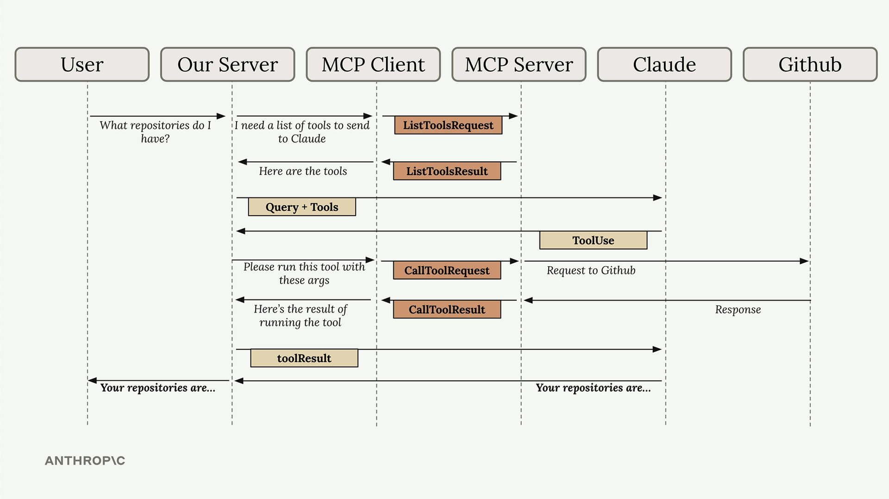

## What Is an MCP Client?
The communication bridge between your app and an MCP server. It handles all the message passing so you don't have to.

## Transport Agnostic
MCP doesn't care how client and server communicate. Most common is same-machine via stdin/stdout, but HTTP, WebSockets, and other protocols work too.

## Two Message Types You'll Use

**ListToolsRequest/Result** — your app asks "what tools are available?" and gets a list back

**CallToolRequest/Result** — your app says "run this tool with these arguments" and gets the result back

## The Complete Flow
1. User asks a question
2. Your server asks MCP client for available tools → `ListToolsRequest`
3. MCP server returns tool list → `ListToolsResult`
4. Your server sends question + tools to Claude
5. Claude decides it needs a tool, responds with a tool use request
6. Your server tells MCP client to run it → `CallToolRequest`
7. MCP server calls the actual external service (e.g. GitHub)
8. Result flows back → `CallToolResult` → your server → Claude
9. Claude formulates final answer → user

## Key Insight
Each component has one clear job. The MCP client abstracts away all the communication complexity — your app just asks for tools and calls them, without worrying about the protocol details underneath.